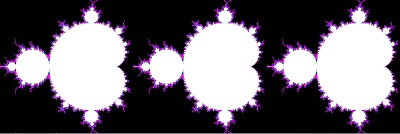

# Mandelbrot gdscript - gdnative c++
This is a changed version of the Godot gdscript c++-example.  
I changed to get a little benchmark-test to see the difference in speed between gdscript and c++ and to learn gdnative c++.  
the test is to draw a mandelbrot - the goal was not to get a good mandelbrotprogram, the goal was to have a comparison in speed.  
there are two Node2D-nodes in one the gdscript in one the gdnative c++.   
left is the mandelbrot from the gdscript, right the one from gdnative c++.  
the result is shown in milliseconds with print.  
gdnative is in my tests ~ 20-25 times faster (in debug) and ~40-45 (in release).  
maybe there are other tasks except mandelbrot where it differs, maybe.  

Version: 0.1   
Author: systemerror    

